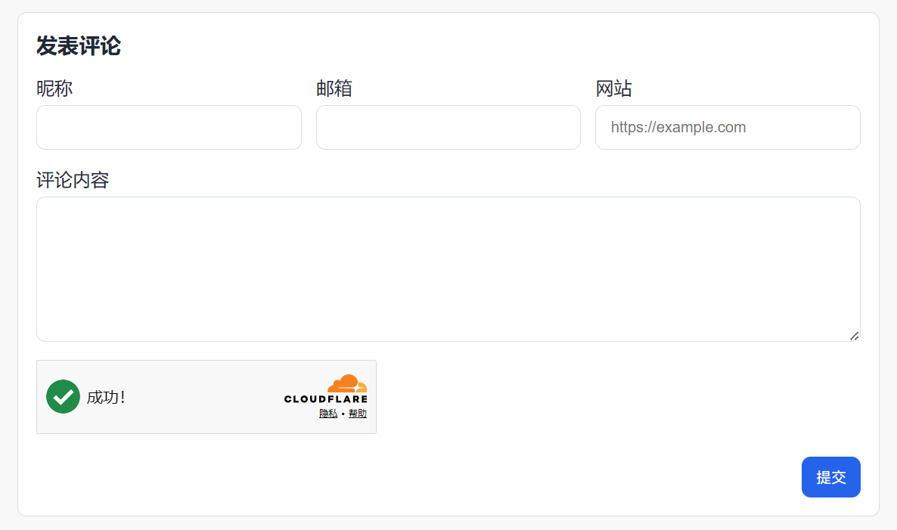
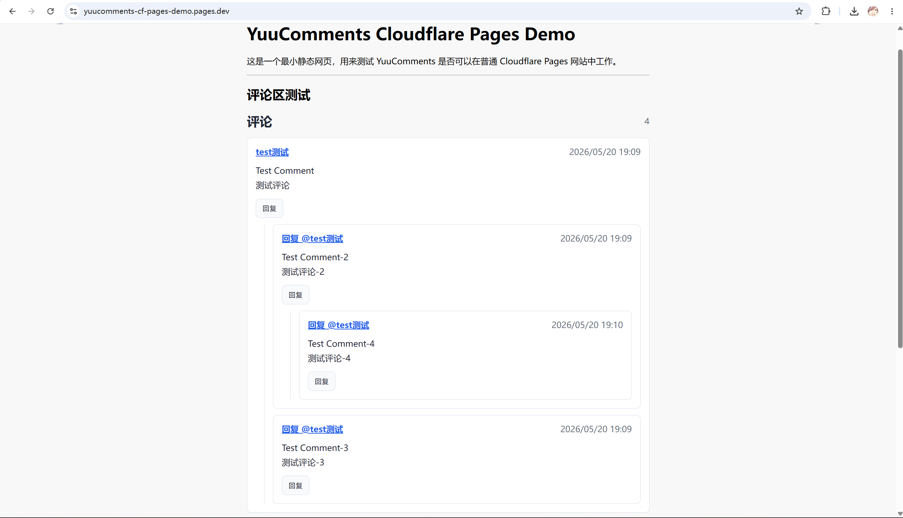
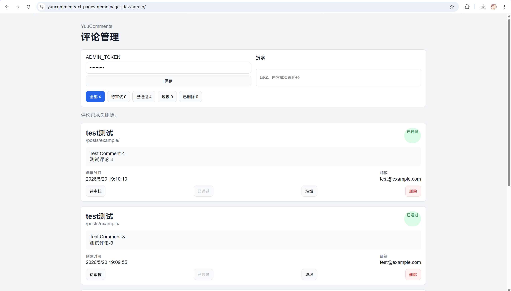

# YuuComments

YuuComments is a lightweight comment system for static websites, built on Cloudflare Workers, D1, Pages, and Turnstile.

YuuComments 是一个面向静态网站的轻量评论系统，基于 Cloudflare Workers、D1、Pages 和 Turnstile 构建。

- Demo site / 示例站点: [https://yuucomments-cf-pages-demo.pages.dev/](https://yuucomments-cf-pages-demo.pages.dev/)
- Admin demo / 后台示例: [https://yuucomments-cf-pages-demo.pages.dev/admin/](https://yuucomments-cf-pages-demo.pages.dev/admin/)
- Demo admin token / 示例后台 Token: `admin12345`

> The demo admin token is public only for preview. Do not use a public token in production.
>
> 示例后台 Token 仅用于公开参观。正式部署时请不要公开自己的 `ADMIN_TOKEN`。

## 为什么做 YuuComments？

YuuComments 最初是从我的个人博客中抽离出来的评论系统。

在给静态博客添加评论区时，我发现中文互联网上很多教程仍然停留在比较旧的方案，例如 LeanCloud、MongoDB、Vercel、GitHub Issues 等。它们并不是不能用，但对普通静态博客用户来说，配置链路往往比较长，也容易遇到平台、数据库、环境变量和部署问题。

所以我把自己博客里已经跑通的评论系统抽离出来，重新整理成一个独立开源项目。

YuuComments 的目标是：

- 尽量使用 Cloudflare 免费生态
- 不需要自建服务器
- 不依赖 MongoDB / LeanCloud
- 不强制 GitHub 登录
- 支持普通静态网站
- 提供评论审核后台
- 尽量降低部署门槛

## Why YuuComments?

YuuComments started as the comment system from my personal blog.

When adding comments to a static blog, I found that many Chinese tutorials still focus on older stacks such as LeanCloud, MongoDB, Vercel, or GitHub Issues. They can work, but for ordinary static blog users the setup chain is often long, and it is easy to run into platform, database, environment variable, and deployment problems.

YuuComments packages a working blog comment system into a standalone open-source project. Its goal is to stay close to Cloudflare's free ecosystem, avoid self-hosted servers, avoid MongoDB and LeanCloud, avoid forced GitHub login, support ordinary static sites, provide a moderation dashboard, and make deployment easier.

## Screenshots / 示例图片

### Comment form / 发表评论



### Comment list and nested replies / 评论列表与嵌套回复



### Admin dashboard / 评论管理后台



## Features

- Lightweight comment system for static websites
- Cloudflare Workers + D1 backend
- Cloudflare Pages frontend demo
- Normal comments and replies
- Nested replies
- Admin moderation dashboard
- Comment status management: pending / approved / spam / deleted
- Search comments by nickname, content, or page path
- Turnstile verification
- English / Chinese UI
- Light / dark theme support
- Works with Astro, Hexo, Hugo, VuePress and plain HTML
- No server required
- No GitHub login required

## 功能

- 适合静态网站的轻量评论系统
- 使用 Cloudflare Workers + D1 作为后端
- 提供 Cloudflare Pages 前端示例
- 支持普通评论和回复
- 支持嵌套回复
- 内置评论审核后台
- 支持评论状态管理：待审核 / 已通过 / 垃圾 / 已删除
- 支持按昵称、内容或页面路径搜索评论
- 支持 Turnstile 人机验证
- 支持英文 / 中文界面
- 支持浅色 / 深色主题
- 可用于 Astro、Hexo、Hugo、VuePress 和普通 HTML
- 不需要自建服务器
- 不强制 GitHub 登录

## Admin Dashboard

YuuComments includes a built-in admin dashboard.

You can:

- review pending comments
- approve comments
- mark comments as spam
- delete comments
- search comments
- view email addresses in the admin panel

## 管理后台

YuuComments 内置评论管理后台。

你可以：

- 查看待审核评论
- 通过评论
- 标记垃圾评论
- 删除评论
- 搜索评论
- 在后台查看评论者邮箱

## Advantages / 优点

- **Low deployment cost / 部署成本低**: built around Cloudflare's free-friendly stack, with Workers, D1, Pages, and Turnstile.
- **Static-site friendly / 适合静态站点**: add comments by publishing a few frontend files and inserting a small HTML snippet.
- **No extra database service / 不需要额外数据库服务**: comment data is stored in Cloudflare D1.
- **No forced account login / 不强制登录账号**: visitors can comment without GitHub login.
- **Moderation first / 默认考虑审核**: comments can stay pending until approved, and the admin dashboard can manage spam and deletion.
- **Portable frontend / 前端接入简单**: works with common static site generators and plain HTML.

## Quick Start / 快速开始

YuuComments 现在推荐使用一键部署脚本启动完整后端流程。
YuuComments now recommends the one-command deployment script for the full backend flow.

```bash
pnpm deploy:backend
```

这个命令会自动安装依赖、检查 Cloudflare 登录、创建或复用 D1、处理 Turnstile、上传 secrets、执行远程 migration、部署 Worker，并生成前端与后台静态文件。
This command installs dependencies, checks Cloudflare login, creates or reuses D1, handles Turnstile, uploads secrets, applies remote migrations, deploys the Worker, and generates frontend and admin static files.

部署完成后，把 `dist/frontend/` 发布到你网站的 `/comments/` 目录。
After deployment, publish `dist/frontend/` to your site's `/comments/` directory.

如果要使用内置后台，把 `dist/admin/` 发布到你网站的 `/admin/` 目录。
If you want to use the built-in dashboard, publish `dist/admin/` to your site's `/admin/` directory.

然后在需要评论区的页面插入这段代码。
Then add this snippet to the page where comments should appear.

```html
<div id="yuucomments" data-page-key="/posts/example/"></div>
<link rel="stylesheet" href="/comments/comments.css" />
<script src="/comments/yuucomments.config.js"></script>
<script src="/comments/comments.js" defer></script>
```

如果你希望评论区和页面 CSS 隔离，可以使用 iframe 嵌入方式。
If you want to isolate the comment widget from page CSS, you can use iframe embed mode.

iframe 嵌入只需要页面加载 `yuucomments-embed.js`，评论资源仍然建议部署在 `/comments/` 目录。
Iframe embed only needs the page to load `yuucomments-embed.js`, while the comment assets should still be deployed under `/comments/`.

```html
<div
  id="yuucomments-iframe"
  data-page-key="/posts/example/"
  data-src="/comments/embed.html"
  data-theme="dark"
  data-lang="zh-CN"
></div>
<script src="/comments/yuucomments-embed.js" defer></script>
```

`data-theme` 支持 `light` 和 `dark`，`data-lang` 支持 `zh-CN` 和 `en`。
`data-theme` supports `light` and `dark`, and `data-lang` supports `zh-CN` and `en`.

更多 iframe 用法请阅读 [iframe 嵌入 / Iframe Embed](docs/embed.md)。
For more iframe usage details, read [iframe 嵌入 / Iframe Embed](docs/embed.md).

详细分步教程请阅读 [Quick Start / 快速开始](docs/quick-start.md)。
For the detailed step-by-step guide, read [Quick Start / 快速开始](docs/quick-start.md).

## Astro Usage / Astro 用法

After deployment, the script also generates an Astro component at `dist/astro/YuuComments.astro`.

部署后，脚本也会生成 `dist/astro/YuuComments.astro` 组件，可复制到 Astro 项目中使用。

```astro
---
import YuuComments from "../components/YuuComments.astro";
---

<YuuComments pageKey={Astro.url.pathname} />
```

## Project Structure / 项目结构

- `worker/`: Cloudflare Worker source code, D1 schema, migrations, and Worker config.
- `frontend/`: vanilla frontend comment widget and Astro component source.
- `admin/`: static admin dashboard files.
- `examples/`: integration examples for common static site setups.
- `docs/`: deployment, security, Turnstile, and Cloudflare API token docs.
- `dist/`: generated frontend and Astro assets after deployment/build steps.

## API Overview / API 概览

- `GET /api/comments?path=/xxx`: fetch approved comments for a page.
- `POST /api/comments`: create a comment or reply.
- `GET /api/admin/comments?status=approved`: list comments in the admin dashboard.
- `PATCH /api/admin/comments/:id/status`: update moderation status.

## Local Development / 本地开发

```bash
pnpm install
pnpm setup
pnpm db:migrate:local
pnpm dev
```

## Documentation / 文档

- [Quick Start / 快速开始](docs/quick-start.md)
- [iframe 嵌入 / Iframe Embed](docs/embed.md)
- [Cloudflare API Token](docs/cloudflare-api-token.md)
- [Turnstile](docs/turnstile.md)
- [Security / 安全说明](docs/security.md)

## Security Notes / 安全说明

- `PUBLIC_TURNSTILE_SITE_KEY` is public and can be used in frontend code.
- `TURNSTILE_SECRET_KEY` must only be stored as a Worker secret.
- `ADMIN_TOKEN` must be kept private in production.
- `CLOUDFLARE_API_TOKEN` is only for deployment and must not be committed.

中文：

- `PUBLIC_TURNSTILE_SITE_KEY` 是公开 Key，可以放在前端。
- `TURNSTILE_SECRET_KEY` 只能作为 Worker secret 保存。
- `ADMIN_TOKEN` 在正式环境中必须保密。
- `CLOUDFLARE_API_TOKEN` 只用于部署，不能提交到仓库。
