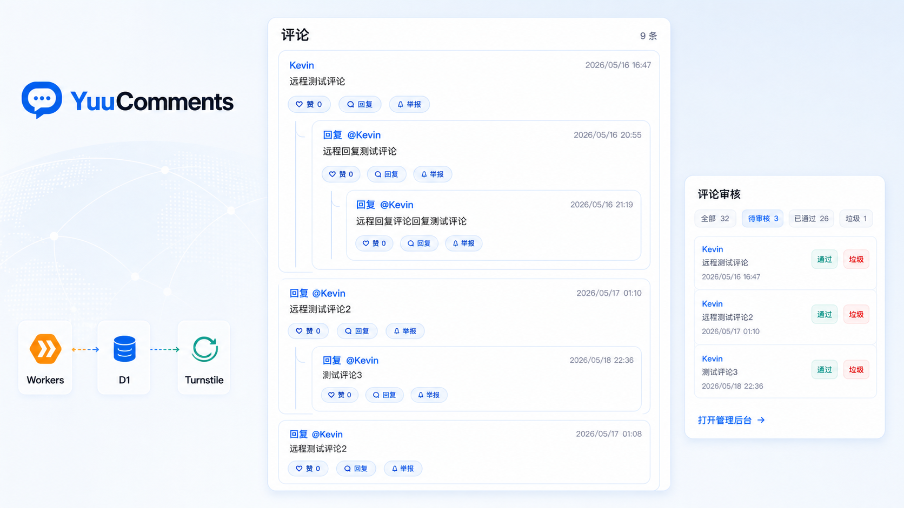
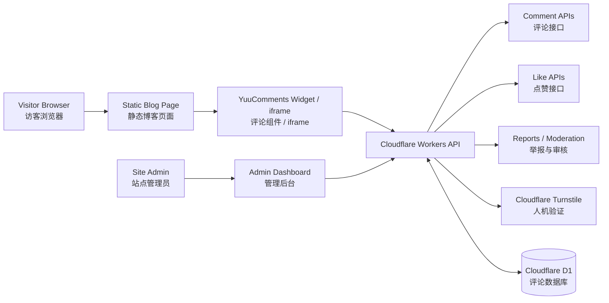

# YuuComments

Cloudflare-native、edge-ready 的静态博客评论系统。  
A Cloudflare-native, edge-ready comment system for static blogs.

No server. No MongoDB. No LeanCloud. No forced GitHub login.

一条命令部署后端，复制几行代码即可接入 Astro / Hexo / Hugo / VuePress / 普通 HTML。  
Deploy the backend with one command, then embed comments into Astro, Hexo, Hugo, VuePress, or plain HTML in minutes.


[Live Demo](https://yuucomments-cf-pages-demo.pages.dev/) | [Admin Demo](https://yuucomments-cf-pages-demo.pages.dev/admin/) | [Quick Start](docs/quick-start.md) | [Docs](#documentation--文档) | [中文说明](docs/quick-start.md)



> Demo admin token: `admin12345`
>
> 示例后台 Token 仅用于公开预览。正式部署时不要公开自己的 `ADMIN_TOKEN`。  
> The demo token is public for preview only. Never expose your production `ADMIN_TOKEN`.

## What is YuuComments? / YuuComments 是什么？

YuuComments 给静态博客添加一个轻量评论区，不需要自建服务器，也不需要 MongoDB、LeanCloud 或 GitHub Issues。

YuuComments adds a lightweight comment area to static blogs without asking you to run a server or connect an external comment database.

它使用 Cloudflare Workers 提供 API，Cloudflare D1 存储评论数据，并用 Turnstile 做人机验证。

It uses Cloudflare Workers for the API, Cloudflare D1 for comment storage, and Turnstile for bot protection.

部署完成后，你只需要发布生成的静态资源，再在页面里插入评论组件或 iframe。

After deployment, publish the generated static assets and embed the widget or iframe into your site.

## Highlights / 亮点

- Cloudflare-native: Workers API, D1 database, Turnstile verification, and Pages-friendly static assets.
- Cloudflare 原生：Workers API、D1 数据库、Turnstile 验证，以及适合 Pages/静态站的前端资源。
- No MongoDB, LeanCloud, self-hosted Node service, or forced GitHub login.
- 不依赖 MongoDB / LeanCloud / 自建 Node 服务，也不强制访客 GitHub 登录。
- One-command backend deployment with D1 setup, migrations, secrets, Worker deploy, and asset generation.
- 一条命令完成 D1、migration、secrets、Worker 部署和静态资源生成。
- Inline widget and iframe embed mode for different blog themes.
- 支持普通直嵌和 iframe 隔离模式，适配不同博客主题。
- Built-in admin dashboard for moderation, search, reports, spam, deletion, and approval.
- 内置后台，可审核、搜索、处理举报、标记垃圾评论、删除或通过评论。
- Anonymous likes, nested replies, reports, Markdown comments, LaTeX math, themes, and English/Chinese UI.
- 支持匿名点赞、嵌套回复、举报、Markdown 评论、LaTeX 公式、主题和中英文界面。

## Demo / 演示

- Live demo / 前台演示: [yuucomments-cf-pages-demo.pages.dev](https://yuucomments-cf-pages-demo.pages.dev/)
- Admin demo / 后台演示: [yuucomments-cf-pages-demo.pages.dev/admin/](https://yuucomments-cf-pages-demo.pages.dev/admin/)
- Demo admin token / 示例后台 Token: `admin12345`

## Edge-Native Architecture / 边缘原生架构



评论组件和后台都是静态资源；真正的写入、审核、点赞、举报和 Turnstile 校验都由 Worker 处理，数据存储在 D1。

The widget and admin dashboard are static assets. The Worker handles writes, moderation, likes, reports, and Turnstile verification, while D1 stores the comment data.

## Features / 功能

- Normal comments and nested replies / 普通评论与嵌套回复
- Markdown comments with GFM-style formatting / 支持 GFM 风格 Markdown 评论
- LaTeX math rendering with KaTeX / 使用 KaTeX 渲染 LaTeX 公式
- Anonymous comment likes / 匿名点赞
- Comment report system / 评论举报
- Admin report management / 后台举报管理
- Admin preview of Markdown comments and LaTeX math / 后台预览 Markdown 评论和 LaTeX 公式
- Pending / approved / spam / deleted moderation states / 待审核、已通过、垃圾、已删除状态
- Automatic return to pending review after repeated reports / 多次举报后自动转回待审核
- Admin dashboard for comments, reports, status changes, and search / 后台管理评论、举报、状态和搜索
- Admin spam & ban workflow / 后台标记垃圾并封禁来源
- Button-based Spam & Ban dialog / 按钮式“标记垃圾并封禁”对话框
- Ban target selection: IP hash, device fingerprint, or both / 可选择封禁 IP hash、设备指纹或同时封禁
- Ban reason presets / 封禁原因预设
- Admin Bans view for reviewing blocked sources / 后台封禁来源管理视图
- IP hash and device fingerprint ban support / 支持 IP hash 和设备指纹封禁
- Block banned sources before comment creation / 创建评论前拦截已封禁来源
- Search by nickname, content, email, or page path / 按昵称、内容、邮箱或页面路径搜索
- Turnstile verification / Turnstile 人机验证
- Light and dark themes / 浅色与深色主题
- English and Chinese UI / 英文与中文界面
- Inline widget and iframe embed modes / 普通直嵌与 iframe 嵌入
- Astro component generation / 自动生成 Astro 组件
- Examples for Astro Mizuki, Hexo, Hugo, and plain HTML / Astro Mizuki、Hexo、Hugo、普通 HTML 示例

## Screenshots / 截图

### Comment Form / 评论表单


### Comment List / 评论列表


### Admin Dashboard / 管理后台


## Quick Start / 快速开始

```bash
pnpm deploy:backend
```

This command will / 这个命令会：

- install dependencies / 安装依赖
- check Cloudflare login / 检查 Cloudflare 登录
- create or reuse D1 / 创建或复用 D1
- configure Turnstile / 配置 Turnstile
- upload Worker secrets / 上传 Worker secrets
- apply remote migrations / 执行远程 migration
- deploy the Worker / 部署 Worker
- generate frontend and admin static assets / 生成前台和后台静态资源

Then publish / 然后发布：

- `dist/frontend/` to `/comments/`
- `dist/admin/` to `/admin/`

v0.1.4 adds frontend-only Markdown comments and LaTeX math rendering. Comment content is still stored as the original Markdown text; no extra backend migration is required for Markdown or math rendering.

v0.1.4 新增前端 Markdown 评论和 LaTeX 公式渲染。评论内容仍以原始 Markdown 文本存储；Markdown 和公式渲染不需要额外后端 migration。

v0.1.5 adds comment source bans. Existing deployments need to apply the new D1 migration before using Spam & Ban.

v0.1.5 新增评论来源封禁。现有部署在使用“标记垃圾并封禁”前需要应用新的 D1 migration。

Full guide / 完整教程: [docs/quick-start.md](docs/quick-start.md)

## API Overview / API 概览

```text
GET    /api/comments
POST   /api/comments
POST   /api/comments/:id/like
DELETE /api/comments/:id/like
POST   /api/comments/:id/report
GET    /api/admin/comments
PATCH  /api/admin/comments/:id/status
POST   /api/admin/comments/:id/spam-ban
DELETE /api/admin/comments/:id
GET    /api/admin/reports
PATCH  /api/admin/reports/:id/status
GET    /api/admin/bans
DELETE /api/admin/bans/:id
```

## Framework Examples / 框架示例

- Astro: generated components in `dist/astro/YuuComments.astro` and `dist/astro/YuuCommentsIframe.astro`
- Astro Mizuki: [examples/astro-mizuki](examples/astro-mizuki/README.md)
- Hexo: [examples/hexo](examples/hexo/README.md)
- Hugo: [examples/hugo](examples/hugo/README.md)
- Plain HTML: [examples/plain-html](examples/plain-html/README.md)
- iframe embed / iframe 嵌入: [docs/embed.md](docs/embed.md)

Minimal inline embed / 最小直嵌代码：

```html
<div
  id="yuucomments"
  data-page-key="/posts/example/"
  data-markdown="true"
  data-math="true"
></div>
<link rel="stylesheet" href="/comments/comments.css" />
<script src="/comments/yuucomments.config.js"></script>
<script src="/comments/comments.js" defer></script>
```

`data-markdown` and `data-math` are enabled by default. Set either value to `"false"` to disable Markdown or formula rendering for that widget. You can also set `window.YuuCommentsConfig.markdown` and `window.YuuCommentsConfig.math`; HTML data attributes take priority.

`data-markdown` 和 `data-math` 默认启用。可以把其中任意值设为 `"false"` 来关闭当前组件的 Markdown 或公式渲染。也可以设置 `window.YuuCommentsConfig.markdown` 和 `window.YuuCommentsConfig.math`；HTML data 属性优先级更高。

Minimal iframe embed / 最小 iframe 嵌入代码：

```html
<div
  id="yuucomments-iframe"
  data-page-key="/posts/example/"
  data-src="/comments/embed.html"
  data-theme="dark"
  data-lang="zh-CN"
  data-markdown="true"
  data-math="true"
></div>
<script src="/comments/yuucomments-embed.js" defer></script>
```

## Why YuuComments? / 为什么选择 YuuComments？

| | YuuComments | Giscus | Twikoo / Waline |
|---|---|---|---|
| Backend / 后端 | Cloudflare Workers | GitHub Discussions | Node.js / serverless |
| Database / 数据库 | Cloudflare D1 | GitHub Discussions | External DB / 外部数据库 |
| Requires GitHub login / 强制 GitHub 登录 | No / 否 | Yes / 是 | No / 否 |
| Self-owned comment data / 自有评论数据 | Yes / 是 | Partly / 部分 | Yes / 是 |
| Built-in moderation dashboard / 内置审核后台 | Yes / 是 | GitHub UI | Yes / 是 |
| Static-site friendly / 适合静态站 | Yes / 是 | Yes / 是 | Yes / 是 |
| Cloudflare-native / Cloudflare 原生 | Yes / 是 | Partly / 部分 | Depends / 取决于部署 |
| iframe embed / iframe 嵌入 | Yes / 是 | Yes / 是 | Depends / 取决于方案 |

YuuComments 更适合想把评论数据放在自己 Cloudflare 账户里、又不想维护服务器或外部数据库的静态博客。

YuuComments is designed for static blog owners who want self-owned comment data inside their Cloudflare account without maintaining a server or separate database service.

## Roadmap / 路线图

YuuComments is still in early development. The current focus is reliability, moderation workflow and easier deployment.

YuuComments 仍处于早期开发阶段。当前重点是可靠性、审核流程和更容易的部署体验。

### Done

- [x] Cloudflare Workers + D1 backend
- [x] Static comment widget
- [x] Admin moderation dashboard
- [x] iframe embed mode
- [x] Anonymous likes
- [x] Comment report system
- [x] Markdown comments and LaTeX math rendering

### Planned before v1.0

- [ ] Email notifications
- [ ] Import / export tools
- [ ] Better spam protection and rate limiting
- [ ] Theme customization
- [ ] More framework examples
- [ ] npm-based CLI distribution
- [ ] Stable v1.0 API and database schema

## Documentation / 文档

- [Quick Start / 快速开始](docs/quick-start.md)
- [Embed / iframe mode / iframe 嵌入](docs/embed.md)
- [Security / 安全说明](docs/security.md)
- [Turnstile](docs/turnstile.md)
- [Cloudflare API Token](docs/cloudflare-api-token.md)

## Security Notes / 安全提醒

- `PUBLIC_TURNSTILE_SITE_KEY` is public and can be used in frontend code. / `PUBLIC_TURNSTILE_SITE_KEY` 是公开 Key，可以放在前端。
- `TURNSTILE_SECRET_KEY` must only be stored as a Worker secret. / `TURNSTILE_SECRET_KEY` 只能作为 Worker secret 保存。
- `ADMIN_TOKEN` must stay private in production. / `ADMIN_TOKEN` 在正式环境中必须保密。
- `CLOUDFLARE_API_TOKEN` is only for deployment and must not be committed. / `CLOUDFLARE_API_TOKEN` 只用于部署，不能提交到仓库。
- Reporter email addresses are stored in plain text in D1 and are visible to admins. / 举报者邮箱会以明文形式保存在 D1 中，管理员可见。
- Report duplicate prevention uses anonymous hashes and does not store raw IP addresses or raw User-Agent values in `comment_reports`. / 举报去重使用匿名 hash，不在 `comment_reports` 中保存原始 IP 或原始 User-Agent。
- Markdown output is sanitized in the frontend before insertion into the page. / Markdown 输出插入页面前会在前端清理。
- Raw user HTML in comments is escaped before Markdown parsing and is not supported as active HTML. / 评论中的原始 HTML 会在 Markdown 解析前转义，不作为活动 HTML 支持。
- Comment links are restricted to safe protocols and rendered with `target="_blank"` plus `rel="nofollow noopener noreferrer"`. / 评论链接限制为安全协议，并带有 `target="_blank"` 与 `rel="nofollow noopener noreferrer"`。

## License / 许可证

MIT License.
